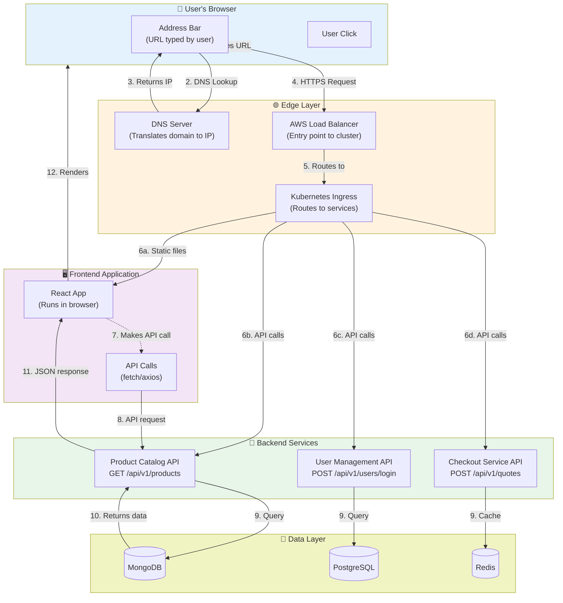
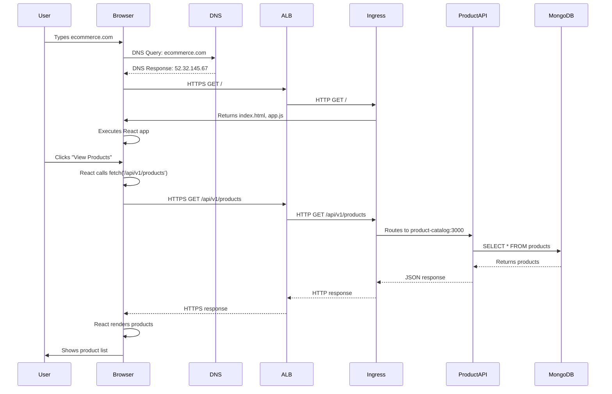

# API Endpoints & Routing Guide

## 📋 Overview

This document explains **what API endpoints are**, **how they relate to URLs**, and **how requests are routed** from the user's browser click to the backend service.

---

## 🎯 What is an API Endpoint?

### Simple Definition

An **API endpoint** is a specific URL path where your frontend can request data or send data to the backend.

**Example:**
```
https://ecommerce.com/api/v1/products
         ↑
    This is the endpoint
```

### Real-World Analogy

Think of API endpoints like **restaurant menu items**:

| Restaurant | API Equivalent |
|------------|----------------|
| Menu item: "Burger" | Endpoint: `/api/v1/products` |
| You order burger | Frontend calls endpoint |
| Kitchen makes burger | Backend processes request |
| Waiter brings burger | Response returns to frontend |

---

## 🔗 Endpoint vs URL vs Route

| Term | Definition | Example |
|------|------------|---------|
| **URL** | Complete web address | `https://ecommerce.com/api/v1/products?category=excavators` |
| **Endpoint** | Specific path in API | `/api/v1/products` |
| **Route** | How server handles that endpoint | `GET /products → productsController.getAll()` |

---

## 🌐 High-Level Architecture



---

## 📍 Step-by-Step Request Flow

### Scenario: User clicks "View Products" button

### Step 1: User Opens Browser
```
User Action: Types "https://ecommerce.com" in browser
```

### Step 2: DNS Resolution
```
Browser: "Where is ecommerce.com?"
DNS Server: "It's at IP 52.32.145.67"
```

### Step 3: Load Balancer Receives Request
```
HTTPS Request:
  GET / HTTP/1.1
  Host: ecommerce.com
  
AWS ALB (Load Balancer):
  - Receives request
  - Terminates SSL (decrypts HTTPS)
  - Forwards to Kubernetes cluster
```

### Step 4: Kubernetes Ingress Routes Request
```yaml
# ingress.yaml - Kubernetes routing rules
apiVersion: networking.k8s.io/v1
kind: Ingress
metadata:
  name: ecommerce-ingress
spec:
  rules:
  - host: ecommerce.com
    http:
      paths:
      # Static files (React app)
      - path: /
        pathType: Prefix
        backend:
          service:
            name: frontend-web
            port:
              number: 80
      
      # Product API
      - path: /api/v1/products
        pathType: Prefix
        backend:
          service:
            name: product-catalog
            port:
              number: 3000
      
      # User API
      - path: /api/v1/users
        pathType: Prefix
        backend:
          service:
            name: user-management
            port:
              number: 8000
      
      # Checkout API
      - path: /api/v1/quotes
        pathType: Prefix
        backend:
          service:
            name: checkout-service
            port:
              number: 8001
```

### Step 5: Frontend Loads (Static Files)
```
Request: GET /
Response: index.html, app.js, styles.css

Browser downloads React app and starts executing it.
```

### Step 6: React Makes API Call (User Click)
```javascript
// User clicks "View Products" button
// React component calls API:

async function loadProducts() {
  const response = await fetch('/api/v1/products?category=excavators');
  const data = await response.json();
  setProducts(data);
}
```

### Step 7: API Request Travels to Backend
```
Browser (React)
  ↓ HTTPS POST /api/v1/products?category=excavators
AWS ALB
  ↓ HTTP (internal)
Kubernetes Ingress
  ↓ Matches path: /api/v1/products
Product Catalog Service (port 3000)
  ↓ Express.js route handler
MongoDB query
  ↓ Returns documents
JSON response
  ↓
Browser (React renders products)
```

---

## 🗺️ Complete Endpoint Map

### Product Catalog Service (Node.js - Port 3000)

| Endpoint | Method | Frontend Calls | Backend Route | Purpose |
|----------|--------|----------------|---------------|---------|
| `/api/v1/products` | GET | `fetch('/api/v1/products')` | `router.get('/', ...)` | List all products |
| `/api/v1/products/:id` | GET | `fetch('/api/v1/products/123')` | `router.get('/:id', ...)` | Get single product |
| `/api/v1/products` | POST | `fetch('/api/v1/products', {method: 'POST'})` | `router.post('/', ...)` | Create product (admin) |
| `/api/v1/categories` | GET | `fetch('/api/v1/categories')` | `router.get('/categories', ...)` | List categories |
| `/api/v1/search` | GET | `fetch('/api/v1/search?q=excavator')` | `router.get('/search', ...)` | Search products |

**Backend Implementation:**
```javascript
// src/routes/products.js
const express = require('express');
const router = express.Router();

// GET /api/v1/products
router.get('/', async (req, res) => {
  const products = await Equipment.find({isActive: true});
  res.json({ success: true, data: products });
});

// GET /api/v1/products/:id
router.get('/:id', async (req, res) => {
  const product = await Equipment.findById(req.params.id);
  res.json({ success: true, data: product });
});

// POST /api/v1/products
router.post('/', authMiddleware, async (req, res) => {
  const product = new Equipment(req.body);
  await product.save();
  res.status(201).json({ success: true, data: product });
});

module.exports = router;
```

### User Management Service (Django - Port 8000)

| Endpoint | Method | Frontend Calls | Backend Route | Purpose |
|----------|--------|----------------|---------------|---------|
| `/api/v1/users` | POST | `fetch('/api/v1/users', {method: 'POST'})` | `@action(detail=False, methods=['post'])` | Register user |
| `/api/v1/users/login` | POST | `fetch('/api/v1/users/login', ...)` | `@action(detail=False, methods=['post'])` | Login |
| `/api/v1/users/me` | GET | `fetch('/api/v1/users/me')` | `@action(detail=False, methods=['get'])` | Get current user |
| `/api/v1/users/:id` | GET | `fetch('/api/v1/users/123')` | N/A (ViewSet) | Get user by ID |
| `/api/v1/users/:id` | PUT | `fetch('/api/v1/users/123', {method: 'PUT'})` | N/A (ViewSet) | Update user |

**Backend Implementation:**
```python
# src/users/views.py
from rest_framework import viewsets
from rest_framework.decorators import action
from rest_framework.response import Response

class UserViewSet(viewsets.ModelViewSet):
    
    @action(detail=False, methods=['post'])
    def login(self, request):
        """POST /api/v1/users/login"""
        email = request.data.get('email')
        password = request.data.get('password')
        user = authenticate(email=email, password=password)
        
        if user:
            token = jwt.encode({'user_id': user.id})
            return Response({'success': True, 'data': {'token': token}})
        
        return Response({'success': False, 'error': 'Invalid credentials'}, status=401)
    
    @action(detail=False, methods=['get'])
    def me(self, request):
        """GET /api/v1/users/me"""
        serializer = UserSerializer(request.user)
        return Response({'success': True, 'data': serializer.data})
```

### Checkout Service (FastAPI - Port 8001)

| Endpoint | Method | Frontend Calls | Backend Route | Purpose |
|----------|--------|----------------|---------------|---------|
| `/api/v1/quotes` | POST | `fetch('/api/v1/quotes', {method: 'POST'})` | `@app.post('/api/v1/quotes')` | Create quote |
| `/api/v1/quotes/:id` | GET | `fetch('/api/v1/quotes/QT-123')` | `@app.get('/api/v1/quotes/{quote_id}')` | Get quote |
| `/api/v1/quotes/:id/accept` | POST | `fetch('/api/v1/quotes/QT-123/accept', ...)` | `@app.post('/api/v1/quotes/{id}/accept')` | Accept quote |
| `/api/v1/delivery/schedule` | POST | `fetch('/api/v1/delivery/schedule', ...)` | `@app.post('/api/v1/delivery/schedule')` | Schedule delivery |

**Backend Implementation:**
```python
# src/api/quotes.py
from fastapi import APIRouter

router = APIRouter()

@router.post("/api/v1/quotes")
async def create_quote(request: QuoteRequest):
    """POST /api/v1/quotes"""
    quote_id = f"QT-{uuid.uuid4().hex[:8].upper()}"
    # Calculate pricing...
    return {"success": True, "data": {"quote_id": quote_id, "total": total}}

@router.get("/api/v1/quotes/{quote_id}")
async def get_quote(quote_id: str):
    """GET /api/v1/quotes/:id"""
    quote = await redis.get(f"quote:{quote_id}")
    return {"success": True, "data": quote}

@router.post("/api/v1/quotes/{quote_id}/accept")
async def accept_quote(quote_id: str):
    """POST /api/v1/quotes/:id/accept"""
    # Update quote status
    return {"success": True, "data": {"status": "accepted"}}
```

---

## 🔄 How Routing Works

### Level 1: DNS Routing (Domain → IP)
```
User types: ecommerce.com
DNS Server returns: 52.32.145.67 (AWS ALB IP)
```

### Level 2: Load Balancer Routing (IP → Kubernetes)
```
Request arrives at: 52.32.145.67:443
ALB Rule: Forward all to Kubernetes Ingress
```

### Level 3: Kubernetes Ingress Routing (Path → Service)
```yaml
# Ingress reads the PATH
Path: /              → frontend-web:80
Path: /api/v1/products → product-catalog:3000
Path: /api/v1/users    → user-management:8000
Path: /api/v1/quotes   → checkout-service:8001
```

### Level 4: Service Routing (Service → Pod)
```yaml
# Kubernetes Service routes to pods with matching labels
Service: product-catalog
Selector: app=product-catalog
Result: Routes to pod-1 (10.244.1.5:3000) OR pod-2 (10.244.2.8:3000)
```

### Level 5: Application Routing (Endpoint → Handler)
```javascript
// Express.js reads the URL path and HTTP method
app.get('/api/v1/products', productsController.getAll);
app.get('/api/v1/products/:id', productsController.getById);
app.post('/api/v1/products', authMiddleware, productsController.create);
```

---

## 📊 Complete Request Journey



---

## 🎯 Key Concepts

### 1. URL Structure
```
https://ecommerce.com/api/v1/products?category=excavators#details
│         │              │              │           │                │
│         │              │              │           └─ Query String (filters)
│         │              │              └─ Endpoint (resource)
│         │              └─ API Version (v1, v2)
│         └─ Domain (where)
└─ Protocol (how)
```

### 2. HTTP Methods = Actions
| Method | Purpose | Example |
|--------|---------|---------|
| `GET` | Read data | Get products list |
| `POST` | Create data | Create new quote |
| `PUT` | Update data | Update user profile |
| `DELETE` | Remove data | Delete product (admin) |

### 3. Response Codes
| Code | Meaning | When |
|------|---------|------|
| `200` | OK | Success |
| `201` | Created | Resource created |
| `400` | Bad Request | Invalid input |
| `401` | Unauthorized | Not logged in |
| `403` | Forbidden | No permission |
| `404` | Not Found | Resource doesn't exist |
| `500` | Server Error | Backend crashed |

---

## 📝 Summary

### What is an API Endpoint?
- ✅ A specific URL path where frontend can request data
- ✅ Example: `/api/v1/products`
- ✅ Part of the full URL

### How is it Routed?
1. **DNS** translates domain to IP
2. **Load Balancer** receives request
3. **Kubernetes Ingress** routes based on path
4. **Service** routes to specific pod
5. **Application** routes to handler function

### Is it Part of the URL?
- ✅ **YES** - Endpoint IS part of the URL
- Full URL: `https://ecommerce.com/api/v1/products`
- Endpoint: `/api/v1/products`

### Do Users Click Endpoints?
- ❌ **NO** - Users click buttons/links in UI
- ✅ **Frontend code** calls endpoints behind the scenes
- Example: User clicks "View Products" → React calls `/api/v1/products`

---

**Document Version:** 1.0  
**Last Updated:** 2026-04-21  
**Maintained By:** DevOps Team
