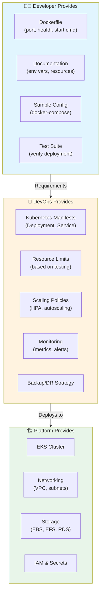

# Developer to Kubernetes Deployment Guide

## 📋 Overview

This document explains the collaboration between **Developers** and **DevOps Engineers** when deploying applications to Kubernetes. It clarifies what information developers must provide and how DevOps translates that into Kubernetes configurations.

---

## 🎭 Roles & Responsibilities

| Role | Provides | Example |
|------|----------|---------|
| **Developer** | Application requirements | "App runs on port 3000, needs MongoDB, health check at `/health`" |
| **DevOps Engineer** | Kubernetes manifests | Deployment YAML with replicas, resource limits, probes |
| **Platform Engineer** | Cluster infrastructure | EKS cluster, networking, storage classes |

---

## 📝 What Developers MUST Provide

Developers define **WHAT** the app needs. Kubernetes experts define **HOW** to run it.

### 1. Dockerfile (Required)

The Dockerfile is the primary source of truth for how an application should be containerized.

```dockerfile
# Example: Node.js Product Catalog Service
FROM node:20-alpine

# Developer specifies the port
EXPOSE 3000

# Developer specifies health check command
HEALTHCHECK --interval=30s --timeout=3s \
  CMD curl -f http://localhost:3000/health || exit 1

# Developer specifies start command
CMD ["node", "src/app.js"]
```

**What This Tells DevOps:**
- ✅ App listens on port `3000`
- ✅ Health check endpoint is `/health`
- ✅ Start command is `node src/app.js`
- ✅ Base image is `node:20-alpine`

### 2. Environment Variables Documentation

Developers must document all configuration options.

```markdown
## Configuration

| Env Var | Required | Default | Description |
|---------|----------|---------|-------------|
| `PORT` | No | `3000` | Port to listen on |
| `MONGODB_URI` | **Yes** | - | MongoDB connection string |
| `LOG_LEVEL` | No | `info` | Logging level (debug/info/warn/error) |
| `MAX_CONNECTIONS` | No | `10` | Max database connections |
```

**Why This Matters:**
- DevOps needs to know which variables are **required** vs optional
- Default values help with local development
- Required variables must be provided via Kubernetes Secrets/ConfigMaps

### 3. Health Check Endpoints

Developers must implement and document health endpoints.

```markdown
## Health Endpoints

### Liveness Probe
- **Endpoint:** `/health/live`
- **Purpose:** Is the app stuck or deadlocked?
- **Response:** HTTP 200 if alive, 500+ if dead
- **Kubernetes Action:** If fails → Restart pod

### Readiness Probe
- **Endpoint:** `/health/ready`
- **Purpose:** Is the app ready to serve traffic?
- **Response:** HTTP 200 if ready, 503 if not
- **Kubernetes Action:** If fails → Remove from service (no traffic)

### Startup Probe (Optional)
- **Endpoint:** `/health/startup`
- **Purpose:** Is the app still starting up?
- **Kubernetes Action:** If fails → Wait (don't kill yet)
```

### 4. Resource Requirements

Developers should provide estimated resource usage.

```markdown
## Resource Requirements

### Development/Testing
- CPU: 100m - 250m
- Memory: 128Mi - 256Mi
- Replicas: 1

### Production
- CPU: 250m - 500m
- Memory: 256Mi - 512Mi
- Replicas: 2+ (for high availability)

### Scaling Triggers
- Scale up when CPU > 70%
- Scale up when Memory > 80%
- Scale down when CPU < 30% for 5 minutes
```

**Resource Units Explained:**
- `100m` = 0.1 CPU core (100 millicores)
- `256Mi` = 256 Mebibytes (~268 MB)
- `500m` = 0.5 CPU core

### 5. Sample Configuration Files

Providing a `docker-compose.yml` or sample config helps DevOps understand dependencies.

```yaml
# docker-compose.yml (Development)
version: '3.8'
services:
  app:
    build: .
    ports:
      - "3000:3000"
    environment:
      - PORT=3000
      - MONGODB_URI=mongodb://mongo:27017/products
    depends_on:
      - mongo

  mongo:
    image: mongo:7
    ports:
      - "27017:27017"
    volumes:
      - mongo-data:/data/db

volumes:
  mongo-data:
```

**What This Tells DevOps:**
- App depends on MongoDB
- MongoDB runs on port 27017
- Data should be persisted (volumes)
- App waits for MongoDB before starting

---

## 🛠️ What DevOps Provides (Translation)

DevOps engineers translate developer requirements into Kubernetes manifests.

### Input from Developer
```dockerfile
EXPOSE 3000
HEALTHCHECK CMD curl http://localhost:3000/health
ENV MONGODB_URI=""
```

### Output from DevOps
```yaml
apiVersion: apps/v1
kind: Deployment
metadata:
  name: product-catalog
spec:
  replicas: 2  # Based on production requirements
  template:
    spec:
      containers:
      - name: product-catalog
        image: myapp/product-catalog:1.0.0
        ports:
        - containerPort: 3000  # From Dockerfile EXPOSE
        env:
        - name: MONGODB_URI  # From developer's env vars
          valueFrom:
            secretKeyRef:
              name: mongodb-secret
              key: uri
        livenessProbe:  # From Dockerfile HEALTHCHECK
          httpGet:
            path: /health
            port: 3000
          initialDelaySeconds: 30
          periodSeconds: 10
        resources:  # Based on developer's estimates + load testing
          requests:
            cpu: 100m
            memory: 256Mi
          limits:
            cpu: 500m
            memory: 512Mi
```

---

## 🔄 The Collaboration Flow



---

## 📋 Developer Checklist

Before handing off to DevOps, ensure you have provided:

### Required
- [ ] **Dockerfile** with:
  - `EXPOSE` directive (port number)
  - `HEALTHCHECK` command (or documentation of health endpoint)
  - `CMD` or `ENTRYPOINT` (start command)
- [ ] **Environment Variables List**:
  - Name, required/optional, default value, description
- [ ] **Health Endpoints**:
  - Liveness: `/health/live` or similar
  - Readiness: `/health/ready` or similar
- [ ] **Port Number(s)** the app listens on

### Recommended
- [ ] **Resource Estimates**:
  - Min/max CPU and memory
  - Expected replicas for production
- [ ] **Sample docker-compose.yml**:
  - Shows dependencies (databases, caches)
  - Shows environment variable usage
- [ ] **Startup Time**:
  - How long does the app take to start?
  - Helps configure `initialDelaySeconds`
- [ ] **Special Requirements**:
  - Does it need privileged mode?
  - Does it need hostNetwork access?
  - Does it need specific Kubernetes features?

### Nice to Have
- [ ] **Helm Chart** (if developer wants to provide K8s config directly)
- [ ] **Kustomize overlays** for different environments
- [ ] **Load testing results** (actual CPU/memory usage under load)

---

## 🏗️ Real-World Example: Complete Translation

### Step 1: Developer Provides

**Dockerfile:**
```dockerfile
FROM node:20-alpine

WORKDIR /app
COPY package*.json ./
RUN npm ci --only=production

EXPOSE 3000
ENV PORT=3000
ENV MONGODB_URI=""
ENV LOG_LEVEL=info

HEALTHCHECK --interval=30s --timeout=3s --start-period=10s --retries=3 \
  CMD curl -f http://localhost:3000/health || exit 1

CMD ["node", "src/app.js"]
```

**README.md Section:**
```markdown
## Environment Variables

| Variable | Required | Default | Description |
|----------|----------|---------|-------------|
| `PORT` | No | `3000` | HTTP port |
| `MONGODB_URI` | **Yes** | - | MongoDB connection |
| `LOG_LEVEL` | No | `info` | Log level |

## Health Checks

- **Liveness:** `GET /health/live`
- **Readiness:** `GET /health/ready`
- **Startup:** Not implemented (starts in <5s)

## Resources

**Recommended for Production:**
- CPU: 250m - 500m
- Memory: 256Mi - 512Mi
- Replicas: 2+

**Scaling:**
- Scale up: CPU > 70% or Memory > 80%
- Scale down: CPU < 30% for 5 minutes
```

### Step 2: DevOps Creates

**deployment.yaml:**
```yaml
apiVersion: apps/v1
kind: Deployment
metadata:
  name: product-catalog
  namespace: ecommerce
  labels:
    app: product-catalog
    version: "1.0"
spec:
  replicas: 2  # From developer's "2+ for production"
  selector:
    matchLabels:
      app: product-catalog
  template:
    metadata:
      labels:
        app: product-catalog
    spec:
      containers:
      - name: product-catalog
        image: myapp/product-catalog:1.0.0
        imagePullPolicy: Always
        
        # From Dockerfile EXPOSE
        ports:
        - name: http
          containerPort: 3000
          protocol: TCP
        
        # From developer's env vars
        env:
        - name: PORT
          value: "3000"
        - name: MONGODB_URI
          valueFrom:
            secretKeyRef:
              name: mongodb-secret
              key: uri
        - name: LOG_LEVEL
          value: "info"
        
        # From Dockerfile HEALTHCHECK + README
        livenessProbe:
          httpGet:
            path: /health/live
            port: 3000
          initialDelaySeconds: 30  # DevOps decides based on startup time
          periodSeconds: 30        # From Dockerfile interval
          timeoutSeconds: 3        # From Dockerfile timeout
          failureThreshold: 3      # From Dockerfile retries
        
        readinessProbe:
          httpGet:
            path: /health/ready
            port: 3000
          initialDelaySeconds: 5   # Ready quickly
          periodSeconds: 10
          timeoutSeconds: 3
          failureThreshold: 3
        
        # From developer's resource estimates
        resources:
          requests:
            cpu: 250m      # Guaranteed
            memory: 256Mi  # Guaranteed
          limits:
            cpu: 500m      # Max allowed
            memory: 512Mi  # Max allowed
        
        # Security context (DevOps best practice)
        securityContext:
          runAsNonRoot: true
          runAsUser: 1001
          readOnlyRootFilesystem: true
          allowPrivilegeEscalation: false
      
      # DevOps adds: DNS policy
      dnsPolicy: ClusterFirst
      
      # DevOps adds: Graceful shutdown
      terminationGracePeriodSeconds: 30
```

**service.yaml:**
```yaml
apiVersion: v1
kind: Service
metadata:
  name: product-catalog
  namespace: ecommerce
spec:
  type: ClusterIP  # Internal only
  selector:
    app: product-catalog
  ports:
  - name: http
    port: 3000       # Service port
    targetPort: 3000 # Container port (from Dockerfile EXPOSE)
    protocol: TCP
```

**hpa.yaml (Horizontal Pod Autoscaler):**
```yaml
apiVersion: autoscaling/v2
kind: HorizontalPodAutoscaler
metadata:
  name: product-catalog-hpa
spec:
  scaleTargetRef:
    apiVersion: apps/v1
    kind: Deployment
    name: product-catalog
  
  # From developer's scaling recommendations
  minReplicas: 2  # "2+ for production"
  maxReplicas: 10 # DevOps decision based on cost
  
  metrics:
  - type: Resource
    resource:
      name: cpu
      target:
        type: Utilization
        averageUtilization: 70  # From developer's "Scale up: CPU > 70%"
  - type: Resource
    resource:
      name: memory
      target:
        type: Utilization
        averageUtilization: 80  # From developer's "Memory > 80%"
```

---

## ⚠️ Common Pitfalls & Solutions

### Pitfall 1: No Health Checks
**Problem:**
```
Dev: "Just deploy it"
DevOps: "How do I know if it's healthy?"
Dev: "It just works?"
Result: Kubernetes can't auto-recover from failures
```

**Solution:**
```javascript
// Developer adds to app.js
app.get('/health/live', (req, res) => {
  res.status(200).json({ status: 'healthy' });
});

app.get('/health/ready', (req, res) => {
  if (db.isConnected()) {
    res.status(200).json({ status: 'ready' });
  } else {
    res.status(503).json({ status: 'not ready' });
  }
});
```

### Pitfall 2: Hardcoded Configuration
**Problem:**
```javascript
// BAD: Hardcoded values
const mongoUri = 'mongodb://localhost:27017/mydb';
const port = 3000;
```

**Solution:**
```javascript
// GOOD: Environment variables
const mongoUri = process.env.MONGODB_URI || 'mongodb://localhost:27017/mydb';
const port = process.env.PORT || 3000;
```

### Pitfall 3: No Resource Guidance
**Problem:**
```
DevOps: Sets 128MB limit
App: Crashes with OOMKilled
DevOps: Increases to 2GB
App: Uses only 100MB (waste)
```

**Solution:**
Developer provides estimates + DevOps monitors actual usage:
```yaml
# Start conservative, adjust based on metrics
resources:
  requests:
    memory: 256Mi  # Based on dev estimate
  limits:
    memory: 512Mi  # Based on dev estimate

# Then monitor and adjust
# kubectl top pods -n ecommerce
```

### Pitfall 4: Unclear Dependencies
**Problem:**
```
Dev: "It works on my machine!"
DevOps: "Why does it try to connect to localhost:27017?"
Result: App fails in Kubernetes (localhost ≠ MongoDB service)
```

**Solution:**
Developer documents dependencies:
```markdown
## Dependencies

- **MongoDB** (required)
  - Version: 7.x
  - Port: 27017
  - Connection: `MONGODB_URI` env var

- **Redis** (optional, for caching)
  - Version: 7.x
  - Port: 6379
  - Connection: `REDIS_URL` env var
```

---

## 📊 Communication Template for Developers

Copy and fill this out when handing off to DevOps:

```markdown
# Application Deployment Requirements

## Basic Info
- **Application Name:** [e.g., Product Catalog Service]
- **Version:** [e.g., 1.0.0]
- **Team:** [e.g., Platform Team]
- **Contact:** [e.g., dev@example.com]

## Container Info
- **Base Image:** [e.g., node:20-alpine]
- **Exposed Port:** [e.g., 3000]
- **Start Command:** [e.g., node src/app.js]

## Environment Variables

| Name | Required | Default | Description | Example |
|------|----------|---------|-------------|---------|
| `PORT` | No | `3000` | HTTP port | `3000` |
| `MONGODB_URI` | **Yes** | - | MongoDB connection | `mongodb://mongo:27017/db` |
| `LOG_LEVEL` | No | `info` | Logging level | `info` |

## Health Endpoints

- **Liveness:** `/health/live`
- **Readiness:** `/health/ready`
- **Startup:** N/A (starts in <5s)

## Resource Requirements

### Development
- CPU: 100m
- Memory: 128Mi
- Replicas: 1

### Production
- CPU: 250m - 500m
- Memory: 256Mi - 512Mi
- Replicas: 2+

## Scaling
- Scale up when: CPU > 70% OR Memory > 80%
- Scale down when: CPU < 30% for 5 minutes

## Dependencies
- MongoDB 7.x (required)
- Redis 7.x (optional, for caching)

## Special Requirements
- [ ] Needs privileged mode
- [ ] Needs hostNetwork
- [ ] Needs specific storage class
- [x ] Stateless (can scale horizontally)

## Notes
- Application is stateless, all state in MongoDB
- Supports graceful shutdown (handles SIGTERM)
- Logs to stdout/stderr (12-factor app)
```

---

## 🎯 Summary

### Developer Responsibilities
1. ✅ Create Dockerfile with `EXPOSE`, `HEALTHCHECK`, `CMD`
2. ✅ Document environment variables (required vs optional)
3. ✅ Implement health check endpoints
4. ✅ Provide resource estimates
5. ✅ Document dependencies (databases, caches)
6. ✅ Test in container locally

### DevOps Responsibilities
1. ✅ Translate requirements to Kubernetes manifests
2. ✅ Set appropriate resource limits (based on testing)
3. ✅ Configure health probes (initialDelay, period, etc.)
4. ✅ Set up monitoring and alerting
5. ✅ Tune based on production metrics
6. ✅ Provide feedback to developers

### Key Success Factors
- **Communication:** Regular sync between Dev and DevOps
- **Documentation:** Keep it updated as app evolves
- **Testing:** Test deployment in staging before production
- **Monitoring:** Watch actual usage, adjust limits accordingly
- **Feedback Loop:** DevOps shares metrics, Dev optimizes app

---

## 📚 Additional Resources

- [Kubernetes Best Practices](https://kubernetes.io/docs/concepts/)
- [Dockerfile Reference](https://docs.docker.com/engine/reference/builder/)
- [12-Factor App Methodology](https://12factor.net/)
- [Kubernetes Resource Management](https://kubernetes.io/docs/concepts/configuration/manage-resources-containers/)

---

**Document Version:** 1.0  
**Last Updated:** 2026-04-21  
**Maintained By:** DevOps Team
